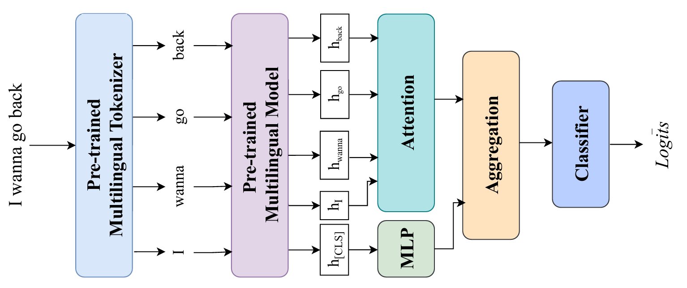

# Penta-Exist-2024

This repository contains the notebooks and papers of the Penta ML and NLP teams in the [EXIST 2024](http://nlp.uned.es/exist2024/) challenge at [CLEF 2024](https://clef2024.imag.fr/). The challenge focuses on detecting and categorizing sexism in online content, including tweets and multimodal data.

## Papers

- **Penta NLP at EXIST 2024 Task 1-3: Sexism Identification, Source Intention, Sexism Categorization In Tweets**

  [](https://ceur-ws.org/Vol-3740/paper-114.pdf) [](https://tinyurl.com/gscholarbanglabook)
- **Penta ML at EXIST 2024  Task 4-6: Tagging Sexism in Online Multimodal Content With Attention-enhanced Modal Context**

  [](https://ceur-ws.org/Vol-3740/paper-90.pdf) [](https://tinyurl.com/gscholarbanglabook)

## Task List

- **Task-1:** Sexism Identification in Tweets
- **Task-2:** Source Intention in Tweets
- **Task-3:** Sexism Categorization in Tweets
- **Task-4:** Sexism Identification in Memes
- **Task-5:** Source Intention in Memes
- **Task-6:** Sexism Categorization in Memes

## Task 1-3 Methodology

The first three tasks are primarily text classification tasks. We used pre-trained multilingual models and applied attention to the contextualized embedding produced by the pre-trained model.



## Task 1-3 Results
Test results with the best-performing configuration with CLS token aggregation on the dev set.


## Task 4-6 Methodology

The next three tasks are multimodal classification tasks. We follow a similar approach using the pre-trained `ViLT` model. The contextual text and image patch embeddings are passed through separate attention networks and then aggregated.


## Task 4-6 Results
Model performances on the validation dataset. Our approach shows a superior macro F1-score in tasks 4 and 6 over the baseline models `CLIP` and `ViLT`. Additional task-wise results on the test set have been included in the paper.


## Contributors

- [Fariha Tanjim Shifat](https://github.com/fariha6412)
- [Fabiha Haider](https://github.com/FabihaHaider)
- [Deeparghya Dutta Barua](https://github.com/arg274)
- [Md Sakib Ul Rahman Sourove](https://github.com/souroveskb)
- [Md Farhan Ishmam](https://github.com/farhanishmam/)
- [Md Fahim](https://github.com/md-fahim/)
- [Farhad Alam Bhuiyan](https://github.com/pdfarhad)

## Citations

If you find our work useful, please cite our papers:

```
@article{shifat2024penta,
  title={Penta-nlp at EXIST 2024 Task 1--3: Sexism Identification, Source Intention, Sexism Categorization In Tweets},
  author={Shifat, Fariha Tanjim and Haider, Fabiha and Sourove, MSUR and Barua, Deeparghya Dutta and Ishmam, Md Farhan and Fahim, Md and Bhuiyan, Farhad Alam},
  journal={Working Notes of CLEF},
  year={2024}
}
```

```
@article{barua2024penta,
  title={Penta ML at EXIST 2024: Tagging Sexism in Online Multimodal Content With Attention-enhanced Modal Context},
  author={Barua, Deeparghya Dutta and Sourove, MSUR and Haider, Fabiha and Shifat, Fariha Tanjim and Ishmam, Md Farhan and Fahim, Md and Bhuiyan, Farhad Alam},
  journal={Working Notes of CLEF},
  year={2024}
}
```
