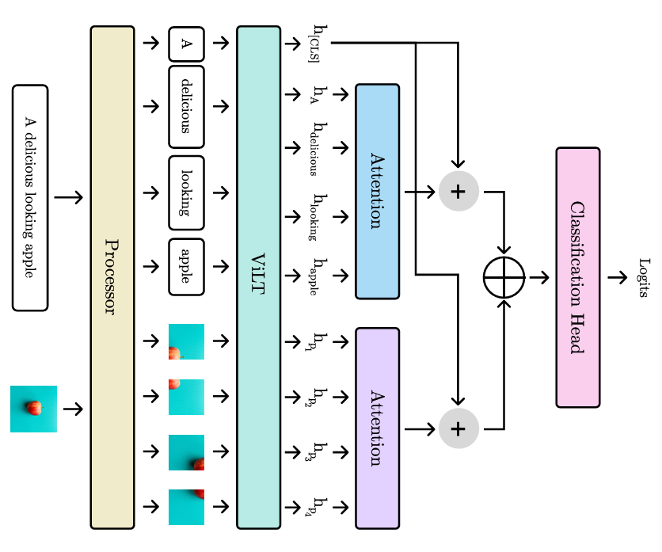
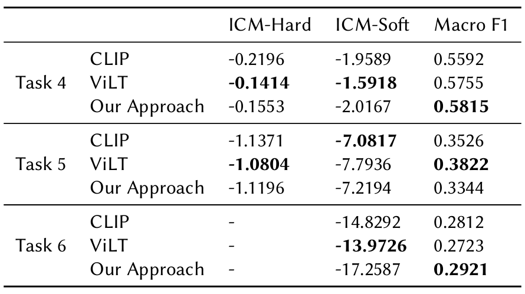

# Penta-Exist-2024

This repository contains the notebooks and papers of the Penta ML and NLP teams in the [EXIST 2024](http://nlp.uned.es/exist2024/) challenge at [CLEF 2024](https://clef2024.imag.fr/).

## Papers

- Penta NLP at EXIST 2024 Task 1-3: Sexism Identification, Source Intention, Sexism Categorization In Tweets

  [](https://ceur-ws.org/Vol-3740/paper-114.pdf) [](https://tinyurl.com/gscholarbanglabook)
- Penta ML at EXIST 2024  Task 4-6: Tagging Sexism in Online Multimodal Content With Attention-enhanced Modal Context

  [](https://ceur-ws.org/Vol-3740/paper-90.pdf) [](https://tinyurl.com/gscholarbanglabook)

## Task 1-3

### Methodology Overview


### Results


## Task 4-6

### Methodology Overview



### Results



## Contributors

- Fariha Tanjim Shifat
- Fabiha Haider
- Deeparghya Dutta Barua
- Md Sakib Ul Rahman Sourove
- Md Farhan Ishmam
- Md Fahim
- Farhad Alam Bhuiyan

## Citations

```
@article{shifat2024penta,
  title={Penta-nlp at EXIST 2024 Task 1--3: Sexism Identification, Source Intention, Sexism Categorization In Tweets},
  author={Shifat, Fariha Tanjim and Haider, Fabiha and Sourove, MSUR and Barua, Deeparghya Dutta and Ishmam, Md Farhan and Fahim, Md and Bhuiyan, Farhad Alam},
  journal={Working Notes of CLEF},
  year={2024}
}
```

```
@article{barua2024penta,
  title={Penta ML at EXIST 2024: Tagging Sexism in Online Multimodal Content With Attention-enhanced Modal Context},
  author={Barua, Deeparghya Dutta and Sourove, MSUR and Haider, Fabiha and Shifat, Fariha Tanjim and Ishmam, Md Farhan and Fahim, Md and Bhuiyan, Farhad Alam},
  journal={Working Notes of CLEF},
  year={2024}
}
```
